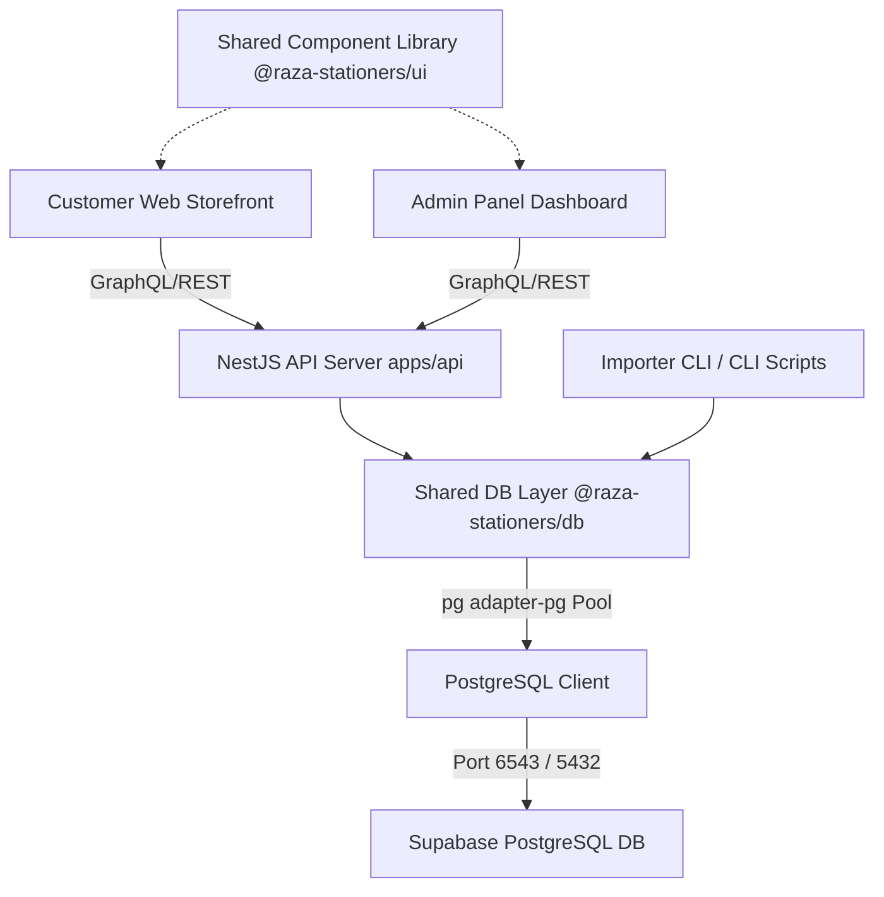
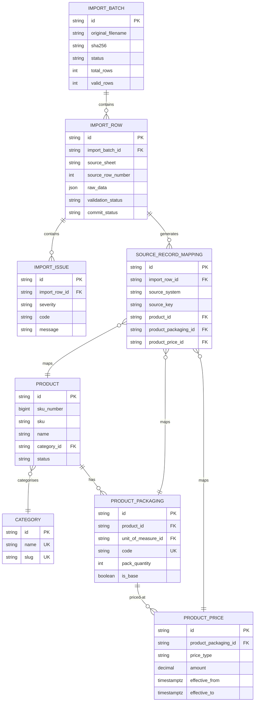
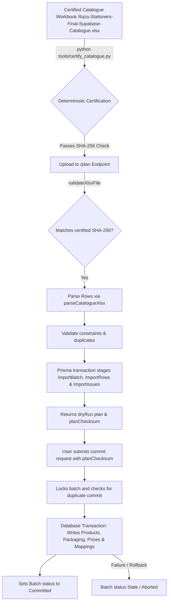

# Raza Stationers — Project Structure Map

This document provides a comprehensive map of the Raza Stationers monorepo codebase. It is designed to help an AI agent or engineer understand the architecture, repository files, database configuration, catalogue import pipeline, and how to safely connect and deploy a fresh Supabase/PostgreSQL database instance.

---

## 1. Repository Identity

*   **Project Name**: Raza Stationers
*   **Repository Root**: `d:\Projects\Raza Stationers`
*   **Current Git Branch**: `phase-3b-3c-catalogue-import`
*   **Current Commit SHA**: `17ea2b0f738a86822b816b9f33882ed813ae1d7d`
*   **Worktree Status**: **Dirty** (contains modified files in `apps/api/src/imports/imports.controller.ts`, `packages/db/src/importer/importer.ts`, `test_importer_hardened.mjs` and several untracked read-only verification/audit scripts).
*   **Monorepo Classification**: Monorepo managed via npm workspaces.
*   **Package Manager**: npm (version `>=9.0.0`)
*   **Workspace Manager**: npm Workspaces (`apps/*`, `packages/*`)
*   **Main Frameworks & Languages**:
    *   **Frontend**: Next.js 15 (React 19, TailwindCSS, GSAP)
    *   **Backend**: NestJS 11 (TypeScript, Express)
    *   **Database Access**: Prisma ORM v7 (PostgreSQL Client with pg driver adapter)
    *   **Scripting**: Python 3 (openpyxl, xml.etree), Node.js ESM/CommonJS scripts
*   **Node.js Version Requirement**: `>=20.19.0`
*   **Important Build, Test, and Verification Commands**:
    *   **Development**:
        *   Storefront: `npm run dev` (runs `@raza-stationers/web` on `http://localhost:3000`)
        *   Admin Panel: `npm run dev:admin` (runs `@raza-stationers/admin` on `http://localhost:3001`)
        *   Backend API: `npm run dev:api` (runs `@raza-stationers/api-server` on `http://localhost:4000`)
        *   All concurrently: `npm run dev:all`
    *   **Build**: `npm run build` (builds all packages and apps in dependency order)
    *   **Prisma Client Generation**: `npm run db:generate`
    *   **Prisma Schema Validation**: `npm run db:validate`
    *   **Verification check**: `npm run verify` (validates schema, generates client, runs typechecks, lints, and builds)
    *   **Catalogue Certification**: `python tools/certify_catalogue.py data/final/Raza-Stationers-Final-Supabase-Catalogue.xlsx`
    *   **Reconciliation Audit**: `node --env-file=.env inspect_counts.mjs`
    *   **Hardened Import Test Suite**: `node --env-file=.env test_importer_hardened.mjs`

---

## 2. Directory Tree

```text
raza-stationers-monorepo/
├── apps/                                  # Applications Workspace
│   ├── admin/                             # Next.js Admin Panel (Dashboard & Catalogue Management)
│   │   ├── src/
│   │   │   ├── app/                       # App Router routes (accounting, catalog, delivery, orders, etc.)
│   │   │   ├── components/                # Modular React components for admin screens
│   │   │   ├── content/mock/              # Local mock data sets
│   │   │   └── lib/                       # Admin helper modules
│   │   └── package.json
│   ├── api/                               # NestJS Backend API Server
│   │   ├── src/
│   │   │   ├── app.controller.ts          # Core endpoints
│   │   │   ├── app.module.ts              # Core module registering all submodules
│   │   │   ├── imports/                   # Catalogue Excel staging & commit controllers
│   │   │   ├── prisma/                    # Shared PrismaService adapter with pg Pool
│   │   │   └── [modules]/                 # Feature modules (auth, orders, catalog, stock, etc.)
│   │   └── package.json
│   ├── mobile/                            # Placeholder workspace for mobile application
│   │   └── package.json
│   └── web/                               # Next.js Customer Storefront (B2B/B2C Ordering Web App)
│       ├── src/
│       │   ├── app/                       # Storefront pages (cart, catalogue, checkout, orders, etc.)
│       │   ├── components/                # Interactive UI controls and layouts
│       │   ├── content/mock/              # B2B mock catalog and user states
│       │   └── lib/                       # GSAP animations, cart utilities
│       └── package.json
├── packages/                              # Shared Library Workspaces
│   ├── api/                               # Shared API clients and request layers
│   ├── db/                                # Shared Database Layer
│   │   ├── prisma/
│   │   │   ├── migrations/                # Supabase PostgreSQL SQL DDL migrations
│   │   │   └── schema.prisma              # Physical Prisma database schema (Source of Truth)
│   │   ├── src/
│   │   │   ├── importer/                  # Catalogue Excel parser, validator & importer logic
│   │   │   └── index.ts                   # Export layer for Prisma adapters and Importer
│   │   └── package.json
│   ├── types/                             # Shared TypeScript interfaces & types
│   ├── ui/                                # Shared React Component Library (Shadcn-based, tokens, CSS)
│   └── validation/                        # Shared Zod validation schemas
├── data/                                  # Catalog data files
│   ├── final/
│   │   ├── Raza-Stationers-Final-Supabase-Catalogue.xlsx  # Authoritative certified catalogue workbook
│   │   └── Raza-Stationers-Final-Supabase-Catalogue.csv   # Flat CSV variant
│   └── source/                            # Original source PDFs from legacy pricing lists
├── docs/                                  # Codebase documentation
│   ├── stabilization/                     # Phase stabilization reviews and feature inventories
│   ├── reviews/                           # Technical audit reports (Deepseek verification)
│   └── PROJECT_STRUCTURE_MAP.md           # This document
├── tools/                                 # General utilities
│   └── certify_catalogue.py               # Deterministic read-only Excel verification script
├── .env.example                           # Template for workspace environment variables
├── package.json                           # Root monorepo workspace configuration
└── [Verification/Audit Scripts]           # Root-level read-only diagnostic scripts (untracked)
```

### Excluded Folders (Generated/Temporary/Dependency)
*   `node_modules/` (Root and sub-package external dependencies - ignored)
*   `.git/` (Git version control database - ignored)
*   `.next/` (Next.js client-side build cache - ignored)
*   `dist/` (Compiled TypeScript outputs for packages and NestJS - ignored)
*   `graphify-out/` (Visual analysis reports generated by graphify - ignored)

---

## 3. Folder Responsibilities

| Path | Purpose | Type | Used By | DB Relevance |
| :--- | :--- | :--- | :--- | :--- |
| `apps/admin` | Next.js back-office dashboard for managing stock, orders, and catalogue uploads. | Source / UI | Admin users | High (triggers Excel imports) |
| `apps/api` | NestJS REST API exposing endpoints for storefront, admin, auth, and imports. | Source / Backend | Web, Admin, Mobile | High (direct DB client adapter) |
| `apps/web` | Next.js storefront allowing customers to browse, filter, and place orders. | Source / UI | Customers | Medium (reads products/prices) |
| `packages/db` | Contains the physical database schema, migrations, and importer core. | DB Package | `apps/api`, scripts | Critical (defines tables/indexes) |
| `packages/db/prisma` | Schema definitions and cumulative SQL migrations. | Migration / Config | Prisma Engine | Critical (schema schema.prisma) |
| `packages/db/src/importer` | Importer parsing and transaction logic executing commits. | Staging Pipeline | Importer CLI / API | Critical (writes products/prices) |
| `packages/types` | Shared TypeScript domain interfaces. | Types | All workspaces | Low (compile-time types) |
| `packages/ui` | Component library containing layout blocks, animation wrappers, and CSS. | UI components | Frontends (`web`, `admin`)| None |
| `packages/validation` | Shared Zod parsing schemas for inputs. | Validation | `apps/api`, Frontends | Low (input protection) |
| `data/final` | Authoritative directory holding the certified XLSX master catalogue workbook. | Canonical Data | Importer, python tools| High (source of truth data) |
| `tools` | Independent deterministic verification scripts. | CLI Tool | CLI / Verification | None (strictly read-only) |

---

## 4. File Inventory

### Root Workspace Configuration & Diagnostic Scripts

| Path | Type | Purpose | Used By | Database Relevance | Status/Notes |
| :--- | :--- | :--- | :--- | :--- | :--- |
| `package.json` | Config | Root npm workspace scripts. | npm CLI | None | Tracked |
| `package-lock.json` | Config | Pinned dependency tree. | npm CLI | None | Tracked |
| `.env.example` | Template | Template of environment variables. | Developers | High | Tracked |
| `README.md` | Doc | Monorepo instructions. | Developers | None | Tracked |
| `summary.md` | Doc | General phase status summary. | Developers | None | Tracked |
| `test_importer_hardened.mjs` | Script | Integration test suite (Tests 1-8). | Node CLI | High | Tracked; writes to DB; requires disposable DB |
| `wipe_db.mjs` | Script | Truncates import batches and rows. | Node CLI | High | Tracked; obsolete (fails on triggers) |
| `seed_test_admin.mjs` | Script | Inserts a default admin login. | Node CLI | High | Tracked; helper |
| `test_readonly_conn.mjs` | Script | Tests DNS/TLS read-only database query. | Node CLI | High | Untracked; diagnostic |
| `inventory_db.mjs` | Script | Computes extensive DB counts. | Node CLI | High | Untracked; diagnostic |
| `proposed_cleanup_transaction.mjs` | Script | Dry-run rollback transaction cleanup. | Node CLI | High | Untracked; diagnostic; ROLLBACK only |
| `inspect_db_triggers.mjs` | Script | Lists active PostgreSQL table triggers. | Node CLI | High | Untracked; diagnostic |
| `inspect_batches_detailed.mjs` | Script | Audits references for all 17 batches. | Node CLI | High | Untracked; diagnostic |
| `inspect_categories_detailed.mjs` | Script | Audits product category references. | Node CLI | High | Untracked; diagnostic |
| `inspect_mappings_detailed.mjs` | Script | Audits 4 Test 7 mappings. | Node CLI | High | Untracked; diagnostic |
| `inspect_prices_detailed.mjs` | Script | Audits prices for product `RS-000001`. | Node CLI | High | Untracked; diagnostic |

### Shared Database Package (`packages/db/`)

| Path | Type | Purpose | Used By | Database Relevance | Status/Notes |
| :--- | :--- | :--- | :--- | :--- | :--- |
| `packages/db/package.json` | Config | DB package dependencies (Prisma). | npm CLI | High | Tracked |
| `packages/db/prisma/schema.prisma`| Schema | Schema definitions (Source of Truth). | Prisma Engine | Critical | Tracked |
| `packages/db/prisma/migrations/20260726162130_initial_schema_v0_1/migration.sql` | Migration | Creates tables, sequences, and protect triggers. | Prisma CLI | Critical | Tracked; baseline SQL |
| `packages/db/prisma/migrations/20260727021642_supabase_runtime_security/migration.sql` | Migration | Configures least-privilege `raza_runtime` role. | Prisma CLI | Critical | Tracked; RLS role security |
| `packages/db/prisma/migrations/20260730103500_phase3b_catalogue_schema/migration.sql` | Migration | Adds `pack_quantity` and CSV import fields. | Prisma CLI | Critical | Tracked; adds CSV columns |
| `packages/db/src/importer/importer.ts`| Source | Imports parser, planner, and transaction logic. | `@raza-stationers/db` | High | Tracked; main execution file |
| `packages/db/src/importer/parser.ts` | Source | Parses raw Excel and CSV rows. | `@raza-stationers/db` | Medium | Tracked |
| `packages/db/src/importer/validator.ts`| Source | Runs staging checks and reports issues. | `@raza-stationers/db` | Low | Tracked |
| `packages/db/src/importer/types.ts` | Types | Input and output interfaces. | `@raza-stationers/db` | None | Tracked |
| `packages/db/src/importer/parse_xlsx.py` | Source | Python helper to read openpyxl quickly. | `parser.ts` | None | Tracked; called by Node child_process |

---

## 5. Application Architecture



### Core Architecture Aspects:
1.  **Frontend App Router**: Both `apps/web` (customer storefront) and `apps/admin` (admin dashboard) are Next.js 15 apps utilizing React Server Components and App Router. Layouts, pages, and components reside under `/src/app/` and `/src/components/`.
2.  **NestJS Backend**: The entry point is `apps/api/src/main.ts` running on port 4000. It bootstraps a modular structure (`app.module.ts`) hosting REST controllers with JWT guards and role-based permissions validation.
3.  **Database Connection Routing**: Database reads/writes are processed by the shared `PrismaService` (`apps/api/src/prisma/prisma.service.ts`) using the `@prisma/adapter-pg` driver adapter. It is configured to run pool queries through a standard PostgreSQL `pg` pool, utilizing:
    *   `DATABASE_URL`: Port 6543 (transaction-pooled pgBouncer, required for NestJS endpoints).
    *   `DIRECT_URL`: Port 5432 (direct connection, required for schema migrations and CLI script operations).

---

## 6. Database Architecture

*   **Prisma Schema Path**: `packages/db/prisma/schema.prisma`
*   **Database Engine**: PostgreSQL 15+ (Supabase)
*   **Schema Control**: Managed through standard Prisma migrations (`prisma migrate dev`). Raw custom DDL (role creation, triggers, sequence privileges) is embedded directly into migration SQL files to maintain reproducibility.

### Core Catalogue / Import Entity Relationship Diagram



### Models & Staging Invariants Table

| Model | Purpose | Important Relations | Key Constraints | Written By |
| :--- | :--- | :--- | :--- | :--- |
| `ImportBatch` | Represents an upload file run. | `rows` (`ImportRow`) | Unique CUID | Importer API / CLI |
| `ImportRow` | Staged raw row data from Excel. | `importBatch`, `issues`, `sourceMappings` | Unique `(importBatchId, sourceSheet, sourceRowNumber)` | Importer API / CLI |
| `ImportIssue` | Validation errors/warnings. | `importRow` | Unique CUID | Importer API / CLI |
| `SourceRecordMapping`| Links source systems keys to DB entities. | `importRow`, `product`, `packaging`, `price` | Unique `(sourceSystem, sourceKey)` | Catalogue Importer |
| `Category` | Normalized product categories. | `products` | Unique `name`, `slug` | Catalogue Importer |
| `Product` | Base logical item inventory. | `category`, `packaging`, `sourceMappings` | Unique `sku`, `skuNumber` | Catalogue Importer |
| `ProductPackaging` | Selling units (e.g. piece, pack).| `product`, `prices` | Unique `(productId, code)` | Catalogue Importer |
| `ProductPrice` | Temporal buying/wholesale prices.| `productPackaging` | Index `(productPackagingId, priceType, effectiveFrom)` | Catalogue Importer |

### PostgreSQL Hardened Safety Triggers (from `20260726162130_initial_schema_v0_1`)
The database contains custom PL/pgSQL triggers designed to protect data integrity:
1.  **`protect_import_batch`** (`import_batches`): Prevents deleting staging batches and prevents updating committed batches.
2.  **`protect_import_row`** (`import_rows`): Prevents deleting staging rows and prevents updates if the parent batch is committed.
3.  **`protect_import_issue`** (`import_issues`): Prevents deleting issues.
4.  **`protect_source_record_mapping`** (`source_record_mappings`): Prevents deleting mappings and blocks updates if the parent batch is committed.

---

## 7. Environment Configuration Map

All applications and scripts load configuration from the root `.env` or local `.env` files.

| Variable Name | Referenced In | Purpose | Required By | Secret? | New Database Action |
| :--- | :--- | :--- | :--- | :--- | :--- |
| `NODE_ENV` | Global configuration | Distinguishes development, test, and production runs. | Next.js, NestJS | No | None |
| `PORT` | NestJS server bootstrap | Port that the backend API server binds to (default: 4000). | NestJS API | No | None |
| `NEXT_PUBLIC_API_URL`| Storefront / Admin | Public facing backend URL to query API endpoints. | Frontends | No | None |
| `JWT_SECRET` | Auth controller, tests | Secret token used to sign and verify user JWT sessions. | NestJS API, Tests | **Yes** | None |
| `DATABASE_URL` | Prisma service, schema | Pooled Connection String (PGBouncer, Port 6543). | NestJS runtime, client | **Yes** | **Update with new project database connection pooler** |
| `DIRECT_URL` | Prisma engine, scripts | Direct Connection String (PostgreSQL, Port 5432). | Migrations, CLI scripts | **Yes** | **Update with new project direct connection** |

---

## 8. API and Backend Map

*   **API Root Controller**: `apps/api/src/app.controller.ts` (exposes health checks: `GET /`)
*   **Module Registration**: Nested inside `apps/api/src/app.module.ts` linking NestJS controllers to services.

### Core API Endpoints

| Method | Route | Handler File | Authentication | Role Required | Models Used | Purpose |
| :--- | :--- | :--- | :--- | :--- | :--- | :--- |
| `POST` | `/admin/imports/catalogue/plan` | `imports.controller.ts` | JWT | `admin` | `ImportBatch`, `ImportRow` | Parses workbook, stages rows, generates staging plan. |
| `POST` | `/admin/imports/catalogue/commit` | `imports.controller.ts` | JWT | `admin` | `Product`, `ProductPackaging`, `ProductPrice`, `SourceRecordMapping`, `Category` | Commits Excel staging data to production catalog. |
| `POST` | `/auth/login` | `auth.controller.ts` | Public | None | `User` | Validates mobile/password and issues JWT session. |
| `GET` | `/catalogue` | `catalogue.controller.ts`| Public | None | `Product`, `Category` | Retrieves active products and categories. |
| `GET` | `/pricing/packaging/:id` | `pricing.controller.ts` | JWT | `business_user` | `ProductPrice` | Fetches active prices. |
| `POST` | `/orders` | `orders.controller.ts` | JWT | `business_user` | `Order`, `OrderItem` | Submits a new purchase order. |

---

## 9. Frontend Map

The B2B customer storefront and admin back-office dashboards are isolated apps in the `/apps/` directory.

### Storefront Application (`apps/web/`)
*   **Main Entry**: `apps/web/src/app/page.tsx`
*   **State Management**: Local React context (`use-auth.tsx`, `use-cart.tsx`).
*   **Authentication**: Stores JWT token in HTTP cookie/state.
*   **Mock data dependencies**: Under `apps/web/src/content/mock/`.

| Route | Page File | Main Components | Data Source | Database Impact |
| :--- | :--- | :--- | :--- | :--- |
| `/` | `src/app/page.tsx` | SiteNav, CategoryGrid | Mock/API | None |
| `/catalogue` | `src/app/catalogue/page.tsx` | ProductCard, CategoryFilter | API `/catalogue` | Read-only |
| `/cart` | `src/app/cart/page.tsx` | CartItemTable, SummaryCard | `use-cart.tsx` state | None |
| `/checkout` | `src/app/checkout/page.tsx` | CheckoutForm | API `/orders` | Writes `Order`, `OrderItem` |
| `/orders` | `src/app/orders/page.tsx` | OrderHistoryCard | API `/orders` | Read-only |

### Admin Dashboard Application (`apps/admin/`)
*   **Main Entry**: `apps/admin/src/app/page.tsx` (redirects to `/dashboard`)

| Route | Page File | Main Components | Data Source | Database Impact |
| :--- | :--- | :--- | :--- | :--- |
| `/dashboard` | `src/app/dashboard/page.tsx` | KpiTile, LowStockList | API `/dashboard` | Read-only |
| `/catalogue` | `src/app/catalogue/page.tsx` | BulkImportModal, ProductGrid | API `/catalogue` | Writes `Product`, uploads catalog |
| `/orders` | `src/app/orders/page.tsx` | OrderTable, OrderDetailDrawer| API `/orders` | Read-write (approvals) |
| `/stock` | `src/app/stock/page.tsx` | StockEntriesTable, RestockDialog| API `/inventory` | Writes `StockMovement` |

---

## 10. Catalogue Import & Certification Flow

The catalogue import workflow routes raw spreadsheets into physical database records under transactional constraints.



### Core Pipeline Details:
1.  **Certified Workbook Specifications**:
    *   **Workbook Path**: `data/final/Raza-Stationers-Final-Supabase-Catalogue.xlsx`
    *   **SHA-256**: `7cb65d6d07b30c75a048431dab4f855fd60b901515c07fe0f2253f8faccafa0b`
    *   **Target size**: 376,017 bytes
    *   **Unique rows**: 2,167
    *   **Unique Categories**: **103** (the Products sheet references 103 distinct categories; early documentation incorrectly listed 104 because it included the header title row index).
2.  **Staging Phase (`generatePlan`)**:
    *   Saves the uploaded file, reads raw rows via `parse_xlsx.py`, normalizes names/categories, and writes an `ImportBatch` with status `uploaded`.
    *   Stages rows as `ImportRow` and writes validation errors to `ImportIssue`.
    *   Generates and returns an **Action Set Checksum** (`planChecksum`).
3.  **Commit Phase (`commitWorkbook`)**:
    *   Verifies that the workbook matches the original plan checksum.
    *   Runs inside a transaction:
        *   Upserts `Category` slugs.
        *   Inserts `Product` records, assigning sequential BigInt keys using the sequence allocator.
        *   Inserts `ProductPackaging` (creating a base packaging record per product).
        *   Inserts buying and wholesale `ProductPrice` records.
        *   Saves `SourceRecordMapping` metadata for each logical record.
        *   Sets the batch status to `committed`.
4.  **Pipeline Protection Mechanisms**:
    *   *Retry Protection*: If the batch file hash has already been committed, the commit is skipped to prevent duplicate imports.
    *   *Forced Rollback*: Triggers fail atomic transaction blocks if constraints are violated, rolling back partial inserts.
    *   *Concurrent Commit Block*: Uses SELECT FOR UPDATE database locking on `ImportBatch` to prevent race conditions during simultaneous uploads.

---

## 11. Tests, Audits, and Verification Commands

This table catalogs all scripts and CLI operations designed for database verification:

| File/Command | Test Type | What It Verifies | Writes to DB? | Rollback/Cleanup | Safe on Fresh DB? |
| :--- | :--- | :--- | :--- | :--- | :--- |
| `python tools/certify_catalogue.py data/final/Raza-Stationers-Final-Supabase-Catalogue.xlsx` | Certification | Workbook checksum, structure, sizes, and pricing consistency. | **No** | None | **Yes** (strictly read-only) |
| `node --env-file=.env test_importer_hardened.mjs` | Integration Test | Full pipeline checks (Tests 1-8), same-file retry, auth matrix, rollback, concurrent commit blocks. | **Yes** | Manually requires DB reset / cleanup | **No** (leaves persistent test fixtures) |
| `node --env-file=.env inspect_counts.mjs` | Reconciliation | Database totals for audit. | **No** | None | **Yes** (read-only) |
| `node --env-file=.env inventory_db.mjs` | Reconciliation | Extensive read-only count table. | **No** | None | **Yes** (read-only) |
| `node --env-file=.env proposed_cleanup_transaction.mjs` | Dry-run Cleanup | Verifies targeted cleanup SQL using assertions and ROLLBACK. | **No** | Explicit transaction `ROLLBACK` | **Yes** (read-only) |
| `node --env-file=.env inspect_db_triggers.mjs` | Security | Exposes active PostgreSQL schema triggers and constraints. | **No** | None | **Yes** (read-only) |
| `node --env-file=.env check_84_cat_fk.mjs` | Audit | Validates that excess categories have zero product/mapping references. | **No** | None | **Yes** (read-only) |

---

## 12. New Database Connection Impact Map

When connecting the codebase to a fresh Supabase PostgreSQL database project, verify the impact scope:

### Must Update (Configuration & Variables)
*   **`.env` in Root**: Set `DATABASE_URL` and `DIRECT_URL` to point to the new project database connection poolers.
*   **Supabase Project Roles**: Execute schema migrations (`prisma migrate deploy`) against the new database to establish tables, and configure the custom least-privilege `raza_runtime` database role.

### May Require Update (Dynamic Cache/Client Generation)
*   **Generated Prisma Client**: Regenerate client classes (`npm run db:generate`) to ensure type mapping aligns with the target schema state.
*   **Staged Test Fixtures**: If run, `test_importer_hardened.mjs` must run against a disposable/test database because it writes mock values (`user_admin123`, `EXCEL_KEY_1`) and alters product price histories.

### Must Not Change (Core Business Logic)
*   **Certified Excel Master Workbook**: `data/final/Raza-Stationers-Final-Supabase-Catalogue.xlsx` must remain unchanged (retaining its registered SHA-256).
*   **PostgreSQL Staging Triggers**: Staging database triggers (`protect_import_batch` etc.) must remain active to prevent unauthorized record deletion in production.
*   **Catalogue Pricing Invariants**: Temporal price transitions, zero-price blocks, and same-file retry policies must remain intact.

---

### Safest Connection Sequence for Fresh Database Deployment

1.  **Environment Preparation**: Confirm the target database environment is a development/disposable instance. Set new pooled (`DATABASE_URL`) and direct (`DIRECT_URL`) strings in the root `.env` file.
2.  **Verify Setup**: Validate the local Prisma schema file layout against system requirements using `npm run db:validate`.
3.  **Generate Client**: Execute `npm run db:generate` to output the Prisma client into `node_modules`.
4.  **Examine Migration History**: Review migrations under `packages/db/prisma/migrations/` to confirm all SQL files are present.
5.  **Apply Migration DDL**: Run `npx prisma migrate deploy` to deploy schemas and custom SQL trigger functions.
6.  **Verify Clean Baseline**: Execute `node --env-file=.env inspect_counts.mjs` to ensure the tables are empty.
7.  **Run Hardened Tests (Staging/Dev)**: Execute `node --env-file=.env test_importer_hardened.mjs` to verify pipeline security.
8.  **Reset Database**: Reset the database to a clean state (`npx prisma migrate reset`) after integration test execution.
9.  **Import Catalogue**: Run the CLI importer command or execute the NestJS backend upload API to perform the initial canonical import.
10. **Verify Baseline**: Run `node --env-file=.env inspect_counts.mjs` and check that counts match the expected baseline totals.

---

## 13. Risks, Uncertainties, and Technical Debt

| Finding | Evidence / File | Severity | DB Migration Impact | Recommended Follow-up |
| :--- | :--- | :--- | :--- | :--- |
| **Active PL/pgSQL Deletion Triggers** | `20260726162130_initial_schema_v0_1/migration.sql` | **High** | Blocks Option B (targeted SQL cleanup) of staging tables in development. | Database resets/re-imports (Option A) should be preferred over targeted delete queries. |
| **Bypassed TLS Certificate Verification** | `packages/db/src/importer/importer.ts`, `prisma.service.ts` | **Medium** | Historical code disabled certificate checks. | Configure a trusted CA and full hostname verification. |
| **Test Fixture Pollution** | `test_importer_hardened.mjs` | **Medium** | Leaves test mock records if run on development DB. | Isolate integration tests to run only on a separate, dedicated test database. |
| **Mock Content in Frontend** | `apps/web/src/content/mock/` | **Low** | Unused mock modules present. | Remove placeholder data modules after API integration is verified. |

---

## 14. Quick Reference Section

*   **Top 20 Critical Database/Import Files**:
    1.  Prisma Schema: [schema.prisma](file:///d:/Projects/Raza%20Stationers/packages/db/prisma/schema.prisma)
    2.  Core Importer: [importer.ts](file:///d:/Projects/Raza%20Stationers/packages/db/src/importer/importer.ts)
    3.  NestJS Service: [prisma.service.ts](file:///d:/Projects/Raza%20Stationers/apps/api/src/prisma/prisma.service.ts)
    4.  Staging Controller: [imports.controller.ts](file:///d:/Projects/Raza%20Stationers/apps/api/src/imports/imports.controller.ts)
    5.  Hardened Tests: [test_importer_hardened.mjs](file:///d:/Projects/Raza%20Stationers/test_importer_hardened.mjs)
    6.  Reconciliation script: [inspect_counts.mjs](file:///d:/Projects/Raza%20Stationers/inspect_counts.mjs)
    7.  Excel Workbook: [Raza-Stationers-Final-Supabase-Catalogue.xlsx](file:///d:/Projects/Raza%20Stationers/data/final/Raza-Stationers-Final-Supabase-Catalogue.xlsx)
    8.  Certification Tool: [certify_catalogue.py](file:///d:/Projects/Raza%20Stationers/tools/certify_catalogue.py)
    9.  Initial Migration: [migration.sql](file:///d:/Projects/Raza%20Stationers/packages/db/prisma/migrations/20260726162130_initial_schema_v0_1/migration.sql)
    10. Role Security Migration: [migration.sql](file:///d:/Projects/Raza%20Stationers/packages/db/prisma/migrations/20260727021642_supabase_runtime_security/migration.sql)
    11. Staging Cleanup Dry-run: [proposed_cleanup_transaction.mjs](file:///d:/Projects/Raza%20Stationers/proposed_cleanup_transaction.mjs)
    12. DB Inventory Script: [inventory_db.mjs](file:///d:/Projects/Raza%20Stationers/inventory_db.mjs)
    13. Root package: [package.json](file:///d:/Projects/Raza%20Stationers/package.json)
    14. API Workspace config: [package.json](file:///d:/Projects/Raza%20Stationers/apps/api/package.json)
    15. Environment template: [.env.example](file:///d:/Projects/Raza%20Stationers/.env.example)
    16. Row Validator: [validator.ts](file:///d:/Projects/Raza%20Stationers/packages/db/src/importer/validator.ts)
    17. File Parser: [parser.ts](file:///d:/Projects/Raza%20Stationers/packages/db/src/importer/parser.ts)
    18. Python parsing helper: [parse_xlsx.py](file:///d:/Projects/Raza%20Stationers/packages/db/src/importer/parse_xlsx.py)
    19. DB package configuration: [package.json](file:///d:/Projects/Raza%20Stationers/packages/db/package.json)
    20. Remediation report: [raza-stationers-deepseek-full-audit-remediation.md](file:///d:/Projects/Raza%20Stationers/raza-stationers-deepseek-full-audit-remediation.md)
*   **Exact Entry Points**:
    *   **Backend API**: `apps/api/src/main.ts`
    *   **Storefront**: `apps/web/src/app/page.tsx`
    *   **Admin Panel**: `apps/admin/src/app/page.tsx`
    *   **Prisma Schema**: `packages/db/prisma/schema.prisma`
    *   **SQL Migrations**: `packages/db/prisma/migrations/`
    *   **Importer Entry Point**: `CatalogueImporter` in `packages/db/src/importer/importer.ts`
*   **Essential Commands**:
    *   **Certification**: `python tools/certify_catalogue.py data/final/Raza-Stationers-Final-Supabase-Catalogue.xlsx`
    *   **Reconciliation**: `node --env-file=.env inspect_counts.mjs`
    *   **Hardened Tests**: `node --env-file=.env test_importer_hardened.mjs`
    *   **Environment Template**: `.env.example`
    *   **Catalogue Path**: `data/final/Raza-Stationers-Final-Supabase-Catalogue.xlsx`
    *   **Documentation Folder**: `docs/`
*   **Handoff Recommendation**: Send the `packages/db/prisma/schema.prisma` file, migrations folder, and the new database connection sequence details to another AI agent tasked with setting up the new Supabase PostgreSQL database.
*   **Open Questions**:
    1.  *Confirm PITR Support*: Confirm if the new database instance has point-in-time recovery (PITR) or manual snapshot backups configured in the Supabase Dashboard.
    2.  *Integration Test Isolation*: Confirm if a dedicated staging/test database instance will be provisioned to run integration tests, preventing test-fixture contamination of the main database.
